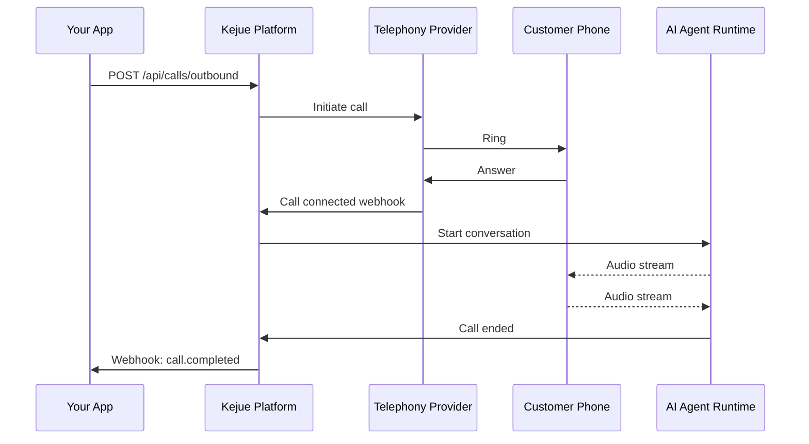
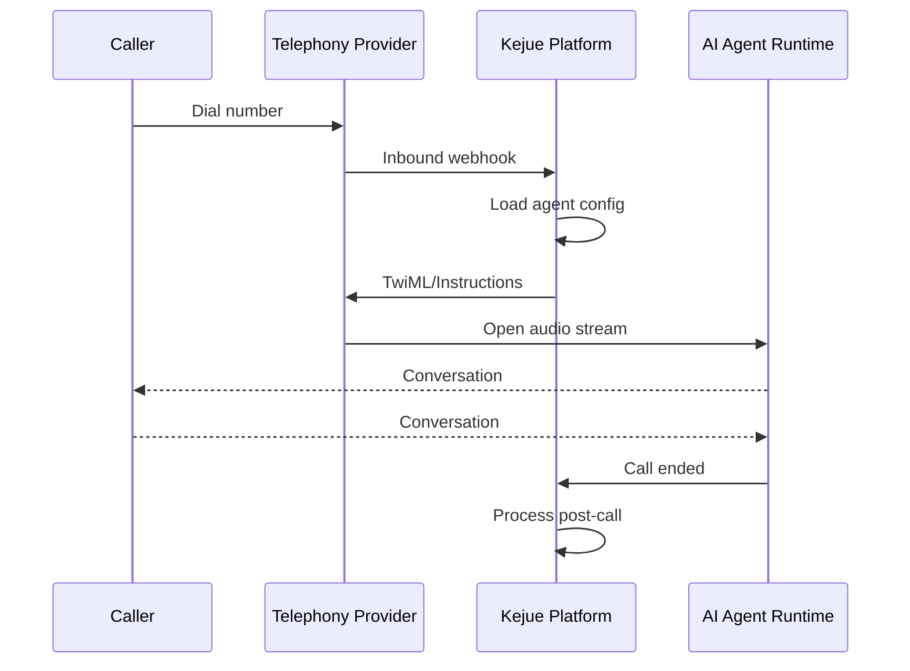

## Introduction

Calls are the core interaction in Kejue - phone conversations between your AI agents and real people. You can make outbound calls programmatically via the API, or receive inbound calls on your configured phone numbers.

## Call Types

### Outbound Calls

Outbound calls are initiated by your application through the API. Common use cases:

- Customer follow-ups
- Appointment reminders
- Lead qualification
- Survey collection
- Order confirmations
- Support outreach

### Inbound Calls

Inbound calls are received on your configured phone numbers. When someone calls your number:

1. The call arrives at your telephony provider
2. Provider routes to Kejue via webhook
3. Kejue assigns the configured agent
4. Conversation begins automatically

## Making Outbound Calls

### Basic Outbound Call

```json
POST /api/calls/outbound
{
  "agentId": "agent-uuid",
  "phoneNumberId": "phone-uuid",
  "to": "+15551234567"
}
```

### With Context Variables

Pass dynamic data to personalize the conversation:

```json
POST /api/calls/outbound
{
  "agentId": "agent-uuid",
  "phoneNumberId": "phone-uuid",
  "to": "+15551234567",
  "contextVariables": {
    "customer_name": "Jane Smith",
    "order_id": "12345",
    "delivery_date": "2024-02-15"
  },
  "metadata": {
    "campaign": "order-followup",
    "source": "shopify"
  }
}
```

### Required Fields

| Field | Type | Description |
|-------|------|-------------|
| `agentId` | UUID | The agent to handle the call |
| `phoneNumberId` | UUID | Your phone number to call from |
| `to` | string | Destination phone number (E.164 format recommended) |

### Optional Fields

| Field | Type | Description |
|-------|------|-------------|
| `contextVariables` | object | Dynamic data for the conversation (used in templates) |
| `metadata` | object | Additional data stored with the call (not used by agent) |

## Context Variables

Context variables allow you to inject dynamic data into your agent's system prompt and greeting. Learn more in the [Context Variables guide](/docs/guides/context-variables).

Example system prompt with variables:

```
You are calling {{customer_name}} about order #{{order_id}}.

Order Details:
- Products: {{products}}
- Total: {{total}}
- Delivery Date: {{delivery_date}}

Ask if they have any questions about their order.
```

When making the call:

```json
{
  "contextVariables": {
    "customer_name": "John Doe",
    "order_id": "12345",
    "products": "Widget Pro, Gadget Plus",
    "total": "$149.99",
    "delivery_date": "Tomorrow"
  }
}
```

## Test Calls (Browser-Based)

Test your agents without making real phone calls:

```json
POST /api/calls/test
{
  "agentId": "agent-uuid",
  "contextVariables": {
    "test_mode": true
  }
}
```

Returns:

```json
{
  "roomUrl": "https://daily.co/room-name",
  "sessionToken": "session-token"
}
```

Open the `roomUrl` in your browser to test the conversation. This uses Daily.co for browser-based audio.

## Call Flow

### Outbound Call Flow



### Inbound Call Flow



## Call Status

Calls progress through several statuses:

| Status | Description |
|--------|-------------|
| `queued` | Call created, waiting to be placed |
| `ringing` | Call is ringing |
| `in_progress` | Call is active, conversation happening |
| `completed` | Call ended normally |
| `failed` | Call failed to connect |
| `no_answer` | Call was not answered |

## Call Details

After a call completes, retrieve full details:

```json
GET /v1/calls/{call-id}

{
  "data": {
    "id": "call-uuid",
    "agentId": "agent-uuid",
    "phoneNumberId": "phone-uuid",
    "status": "completed",
    "direction": "outbound",
    "customerNumber": "+15551234567",
    "durationSeconds": 245,
    "recordingUrl": "https://...",
    "transcriptUrl": "https://...",
    "summaryUrl": "https://...",
    "extractedData": {
      "customer_interest": "premium plan",
      "follow_up_needed": true
    },
    "startedAt": "2024-01-15T10:30:00Z",
    "endedAt": "2024-01-15T10:34:05Z",
    "createdAt": "2024-01-15T10:29:45Z"
  }
}
```

## Recordings and Transcripts

If enabled, calls include:

- **Recording URL**: Audio recording of the conversation
- **Transcript URL**: Text transcript with speaker labels
- **Summary URL**: AI-generated summary

Access URLs are included in the call object and webhook payloads.

## Post-Call Data

### Extracted Data

If your agent has a `postCallExtractionSchema` configured, structured data is extracted:

```json
{
  "extractedData": {
    "customer_satisfaction": "satisfied",
    "issue_resolved": true,
    "follow_up_date": "2024-02-01",
    "product_interest": "premium"
  }
}
```

### Webhooks

Receive notifications when calls complete. See the [Webhooks guide](/docs/guides/webhooks) for details.

```json
POST https://your-app.com/webhook
{
  "event": "call.completed",
  "callId": "call-uuid",
  "status": "completed",
  "duration": 245,
  "extractedData": {...},
  "summary": "Customer inquiry about...",
  "recordingUrl": "https://..."
}
```

## Call Duration Limits

Agents can be configured with maximum call duration (30-3600 seconds). Calls automatically end when this limit is reached.

Default: 600 seconds (10 minutes)

## Cost Tracking

Calls include cost tracking if your organization is on a paid plan. Costs include:

- Telephony provider charges (Twilio/SIP)
- AI inference costs
- Text-to-speech costs
- Speech-to-text costs

View costs in the call details and dashboard.

## Best Practices

### Outbound Calls

1. **Use Context Variables**: Personalize conversations with customer data
2. **Set Metadata**: Track campaigns, sources, and custom identifiers
3. **Handle Failures**: Implement retry logic for failed calls
4. **Respect Time Zones**: Consider the recipient's local time
5. **Compliance**: Follow TCPA and local regulations

### All Calls

1. **Configure Webhooks**: Get real-time notifications
2. **Monitor Durations**: Set appropriate max duration limits
3. **Review Transcripts**: Continuously improve agent performance
4. **Extract Data**: Use extraction schemas for structured data
5. **Test Thoroughly**: Use test calls before production

## Troubleshooting

### Call Not Connecting

**Check:**
- Phone number format (use E.164: +15551234567)
- Phone number configuration is correct
- Agent is active
- Organization has sufficient balance

### Poor Audio Quality

**Possible causes:**
- Network connectivity issues
- SIP configuration problems
- Provider issues

**Solutions:**
- Test from different networks
- Verify SIP settings
- Check provider status

### Agent Not Responding

**Check:**
- Agent is active and properly configured
- System prompt is clear and actionable
- Model and voice are correctly set
- No API errors in logs

## API Reference

- [Create Outbound Call](/docs/api-reference) - POST /api/calls/outbound
- [Create Test Call](/docs/api-reference) - POST /api/calls/test
- [List Calls](/docs/api-reference/calls/listCalls) - GET /v1/calls
- [Get Call](/docs/api-reference/calls/getCall) - GET /v1/calls/\{id\}

## Next Steps

- Learn about [Agents](/docs/core-concepts/agents) to configure call behavior
- Set up [Phone Numbers](/docs/core-concepts/phone-numbers) for inbound calls
- Configure [Webhooks](/docs/guides/webhooks) for notifications
- Explore [Context Variables](/docs/guides/context-variables) for personalization


